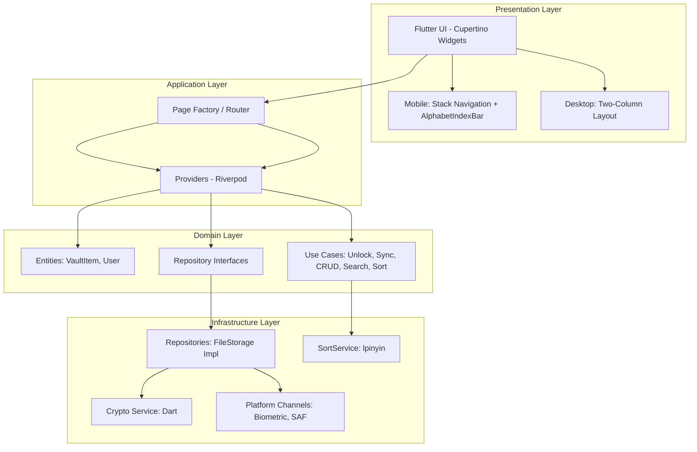

# NotePassword 架构设计文档 (Architecture Design)

**系统名称**: NotePassword (密码本)
**状态**: In Review
**版本**: 2.2
**日期**: 2026-03-01

---

## 1. 系统概述 (System Overview)

### 1.1 核心目标 (Goal)
构建一款 **"Local-First" (本地优先)** 的跨平台密码管理器，提供类似 1Password 的原生体验，但**完全去除**厂商云服务依赖。

### 1.2 技术约束 (Constraints)
*   **无服务端:** 不搭建任何后端服务器，纯本地/云盘存储。
*   **跨平台:** 需同时支持 iOS, Android, macOS, Linux。
*   **安全:** 零知识架构 (Zero-Knowledge)，数据必须在本地加密后存储。
*   **性能:** 冷启动 < 1秒 (移动端)，列表滚动 60fps，1000条排序 < 100ms。

---

## 2. 高层架构 (High-Level Architecture)

### 2.1 架构模式 (Pattern)
**MVVM (Model-View-ViewModel)** + **Clean Architecture** 分层理念。

核心原则：**"Dart Core as Single Source of Truth"** —— 所有业务逻辑、状态管理、加密操作均由 Dart 层统一管理，UI 层仅负责渲染。

### 2.2 架构图 (Architecture Diagram)



### 2.3 数据流 (Data Flow)
*   **单向数据流 (Unidirectional):** UI → Riverpod Providers → Use Cases → Repositories → Data Sources。
*   **状态更新:** 通过 Riverpod 的 `StateNotifier` 或 `@riverpod` 注解自动通知 UI 重建。

---

## 3. 分层详情 (Layer Detail)

### 3.1 Presentation Layer (UI Layer)

#### 目录结构
```
lib/presentation/
├── pages/
│   ├── mobile/              # 移动端特定页面
│   │   ├── home_page.dart
│   │   ├── detail_page.dart
│   │   └── settings_page.dart
│   ├── desktop/             # 桌面端特定页面
│   │   ├── desktop_home_page.dart
│   │   ├── detail_panel.dart
│   │   └── settings_dialog.dart
│   └── shared/              # 共享页面
│       ├── unlock_page.dart
│       └── onboarding_page.dart
├── widgets/                 # 可复用组件
│   └── alphabet_index_bar.dart  # 移动端字母索引组件
└── providers/              # Riverpod Providers
```

#### 平台适配策略
*   **Mobile:** 使用 `CupertinoPageScaffold` + 栈式导航 (Push/Pop)。列表条目 >= 20 条时，右侧显示 `AlphabetIndexBar` 快速跳转组件。
*   **Desktop:** 使用 `Row` + `Expanded` 实现左右分栏，中间通过 `MouseRegion` 实现可拖拽分割线。
*   **PlatformUtils:** 统一的平台检测工具类，用于动态选择渲染策略。

#### AlphabetIndexBar 组件
移动端专用字母索引组件，仅在列表条目 >= 20 时渲染。

```dart
// lib/presentation/widgets/alphabet_index_bar.dart
class AlphabetIndexBar extends StatelessWidget {
  final List<String> letters; // 动态生成，只包含列表中实际存在的首字母
  final Function(String) onLetterTap;

  // 使用 GestureDetector 捕获滑动手势
  // 使用 excludeFromSemantics 避免与列表手势冲突
  // 放大镜覆盖层使用 Stack + AnimatedOpacity 实现
}
```

#### ListView 优化策略
*   **必须使用** `ListView.builder` 构建长列表。
*   **固定高度列表项:** 使用 `itemExtent` 跳过布局计算。
*   **避免重建:** 使用 `const` 构造函数和 `StatelessWidget`。

### 3.2 跨平台功能复用 (Feature Layer - 核心原则)

> **⚠️ 核心原则:** "功能逻辑只写一次，UI 逻辑按平台适配"

#### 3.2.1 分层规则

| 层级 | 职责 | 是否跨平台复用 |
| :--- | :--- | :--- |
| **Domain/Use Cases** | 业务逻辑 (如：复制密码、加密数据、搜索排序) | ✅ **100% 复用** |
| **Domain/Entities** | 数据模型 | ✅ **100% 复用** |
| **Domain/Repositories** | 仓库接口 | ✅ **100% 复用** |
| **Infrastructure** | 平台实现 (文件读写、加密库) | ⚠️ 按平台实现 |
| **Presentation/Providers** | 状态管理 | ✅ **100% 复用** |
| **Presentation/Pages** | 页面结构 | ❌ 按平台独立 |
| **Presentation/Widgets** | UI 组件 | ⚠️ 部分复用 |

#### 3.2.2 错误示例 (❌ 不要这样做)

```dart
// ❌ Mobile 端写一套
class DetailPage extends StatelessWidget {
  void copyPassword() {
    Clipboard.setData(ClipboardData(text: item.password));
    // Mobile 特有的 Toast
  }
}

// ❌ Desktop 端再写一套
class DetailPanel extends StatelessWidget {
  void copyPassword() {
    Clipboard.setData(ClipboardData(text: item.password));
    // Desktop 特有的通知
  }
}
```

#### 3.2.3 正确示例 (✅ 应该这样做)

**Step 1: 在 Domain Layer 定义 Use Case**

```dart
// lib/domain/use_cases/copy_password_usecase.dart
class CopyPasswordUseCase {
  // 纯业务逻辑，无 UI 依赖
  String execute(VaultItem item) {
    return item.password; // 返回密码
  }
}

class CopyAllCredentialsUseCase {
  // 组合用户名+密码+网址+备注
  String execute(VaultItem item) {
    return [
      item.username,
      item.password,
      item.url,
      item.notes,
    ].where((s) => s != null).join('\n');
  }
}
```

**Step 2: 在 Presentation Layer 调用 Use Case**

```dart
// lib/presentation/providers/vault_provider.dart
class VaultNotifier extends StateNotifier<VaultState> {
  final CopyPasswordUseCase _copyPasswordUseCase;
  final CopyAllCredentialsUseCase _copyAllUseCase;

  void copyPassword(String itemId) {
    final item = findItem(itemId);
    final password = _copyPasswordUseCase.execute(item); // 复用逻辑
    // ⚠️ 只有这里是平台特定的：Clipboard.setData
    Clipboard.setData(ClipboardData(text: password));
  }

  void copyAllCredentials(String itemId) {
    final item = findItem(itemId);
    final content = _copyAllUseCase.execute(item); // 复用逻辑
    Clipboard.setData(ClipboardData(text: content));
  }
}
```

**Step 3: Mobile UI 调用 Provider**

```dart
// lib/presentation/pages/mobile/detail_page.dart
class MobileDetailPage extends ConsumerWidget {
  @override
  Widget build(BuildContext context, VaultNotifier notifier) {
    return Column(
      children: [
        CupertinoButton(
          child: Text('复制密码'),
          onPressed: () => notifier.copyPassword(item.id),
        ),
        CupertinoButton(
          child: Text('复制全部'),
          onPressed: () => notifier.copyAllCredentials(item.id),
        ),
      ],
    );
  }
}
```

**Step 4: Desktop UI 调用同一个 Provider**

```dart
// lib/presentation/pages/desktop/detail_panel.dart
class DesktopDetailPanel extends ConsumerWidget {
  @override
  Widget build(BuildContext context, VaultNotifier notifier) {
    return Column(
      children: [
        CupertinoButton(
          child: Text('复制密码'),
          onPressed: () => notifier.copyPassword(item.id), // 同一个方法！
        ),
        CupertinoButton(
          child: Text('复制全部'),
          onPressed: () => notifier.copyAllCredentials(item.id), // 同一个方法！
        ),
      ],
    );
  }
}
```

#### 3.2.4 总结

*   **Use Case:** 定义"做什么" (What)，不关心"怎么做" (How to display)。
*   **Provider:** 协调 Use Case + 平台特定操作 (如 Clipboard)。
*   **Page/Widget:** 负责"怎么显示" (How to display)。

这样，"复制密码"的逻辑只写了一次，但 UI 可以根据平台定制 (Mobile 可以用 CupertinoButton，Desktop 也可以用，但布局不同)。

### 3.3 Domain Layer (Core Business Logic)

#### 核心实体 (Entities)
```dart
// VaultItem: 密码条目
class VaultItem {
  final String id;
  final String title;
  final String? username;
  final String? password; // 加密存储
  final String? url;
  final String? notes;
  final DateTime updatedAt;
  final List<Attachment>? attachments;
  final String titlePinyin; // 预计算拼音，写入时由 SortService 生成
}

// Vault: 密码库
class Vault {
  final String id;
  final List<VaultItem> items;
  final DateTime lastModified;
}
```

#### SortService (排序服务)
混排规则：**数字优先，英文与中文按拼音混排**（非3段式分组）。

```dart
// lib/domain/services/sort_service.dart
class SortService {
  /// 比较函数：数字开头 < 英文/中文按拼音混排
  static int compareVaultItems(VaultItem a, VaultItem b) {
    final aKey = _getSortKey(a);
    final bKey = _getSortKey(b);
    final aIsDigit = _isDigit(aKey);
    final bIsDigit = _isDigit(bKey);
    if (aIsDigit != bIsDigit) return aIsDigit ? -1 : 1;
    return aKey.compareTo(bKey);
  }

  /// 获取排序键：中文取 titlePinyin 首字母，其他取原始首字符
  static String _getSortKey(VaultItem item) {
    if (item.title.isEmpty) return '';
    final first = item.title[0];
    if (_isChinese(first)) return item.titlePinyin.isNotEmpty
        ? item.titlePinyin[0].toLowerCase()
        : first;
    return first.toLowerCase();
  }

  static bool _isDigit(String s) =>
      s.isNotEmpty && s.codeUnitAt(0) >= 48 && s.codeUnitAt(0) <= 57;

  static bool _isChinese(String s) =>
      s.isNotEmpty && s.codeUnitAt(0) >= 0x4E00 && s.codeUnitAt(0) <= 0x9FFF;

  /// 预计算拼音（写入时调用）
  static String computePinyin(String title) {
    if (title.isEmpty) return '';
    return PinyinHelper.getPinyinE(title, separator: '');
  }
}
```

#### Use Cases (业务用例)
*   **UnlockVault:** 解锁密码库 (密钥派生 + 解密)。
*   **LockVault:** 锁定密码库 (清理内存中的 Session Key)。
*   **SyncData:** 同步数据 (检测冲突 + 合并)。
*   **CRUD:** 密码条目的增删改查（写入时预计算 `titlePinyin`）。
*   **SearchVaultItemsUseCase:** 在 Background Isolate 中执行搜索，保证 UI 60fps。

```dart
// lib/domain/use_cases/search_vault_items_usecase.dart
class SearchVaultItemsUseCase {
  /// 在 compute() 中执行，避免阻塞 UI 线程
  Future<List<VaultItem>> execute(List<VaultItem> items, String query) {
    return compute(_search, _SearchParams(items, query));
  }
}

List<VaultItem> _search(_SearchParams params) {
  final q = params.query.toLowerCase();
  return params.items.where((item) =>
    item.title.toLowerCase().contains(q) ||
    (item.titlePinyin.toLowerCase().contains(q)) ||
    (item.username?.toLowerCase().contains(q) ?? false)
  ).toList();
}
```

#### Repository Interfaces (抽象接口)
```dart
abstract class VaultRepository {
  Future<Vault> loadVault(String masterPassword);
  Future<void> saveVault(Vault vault);
  Future<void> deleteItem(String id);
}
```

### 3.4 Infrastructure Layer (数据基础设施)

#### 加密服务 (Crypto Service)
*   **密钥派生:** Argon2id (Iterations: 3, Memory: 64MB, Parallelism: 4)
*   **数据加密:** AES-256-GCM
*   **实现:** 纯 Dart (`cryptography` + `encrypt` 包)

#### 排序与拼音 (Sort & Pinyin)
*   **拼音库:** `lpinyin` 包，使用 `PinyinHelper.getPinyinE()` 获取拼音字符串。
*   **预计算策略:** `titlePinyin` 在条目**写入时**计算并持久化，避免每次排序的运行时开销。
*   **排序触发:** 在 `VaultProvider` 的 `sortedItems` getter 中调用 `SortService.compareVaultItems`，不额外存储排序结果。

```dart
// VaultProvider 中的排序 getter
List<VaultItem> get sortedItems {
  final items = vault?.items ?? [];
  return List.from(items)..sort(SortService.compareVaultItems);
}
```

#### Isolates 使用策略 (⚠️ 关键)
> **强制要求:** 所有耗时操作（加密/解密/Hash/**搜索**）**必须**在 Background Isolates 中执行，禁止在 Main Thread 直接操作。

```dart
// ✅ 正确示例（加密）
final encryptedData = await compute(_encryptData, params);

// ✅ 正确示例（搜索）
final results = await compute(_search, _SearchParams(items, query));

// ❌ 错误示例 (阻塞 UI)
final encryptedData = encryptData(params);
```

#### 存储策略
*   **iOS/macOS:** `Documents` 目录 (自动支持 iCloud Drive 同步)。
*   **Android:** SAF (Storage Access Framework)，缓存 `document_uri` 避免重复扫描。
*   **格式:** 单加密 JSON 文件 (`vault.json`)，`VaultItem` 包含持久化的 `titlePinyin` 字段。

#### 同步机制 (Sync)
*   **iOS/macOS:** 使用 `Timer` 轮询 iCloud Drive 文件元数据 (Modification Time)，建议轮询间隔 **30秒**。
*   **Android:** 依赖 SAF 文件流 + 云服务后台推送。
*   **冲突解决:** **Keep Both** 策略。检测到版本冲突时，自动将远程版本保存为 `vault_conflict_{timestamp}.db`，并提示用户。

#### Session Key 生命周期
*   **解锁时生成:** Master Password → Argon2id → Session Key (存入内存)。
*   **锁定时销毁:** 调用 `LockVault` 时立即清空内存中的 Session Key。
*   **超时失效:** 支持自动锁屏超时 (0-60分钟)，超时后自动清理 Session Key。

---

## 4. 横切关注点 (Cross-Cutting Concerns)

### 4.1 错误处理 (Error Handling)
*   **策略:** 全局捕获异常 (Zone.handleUncaughtError)。
*   **用户体验:** 显示用户友好的错误提示 (如"解密失败，请检查密码")，而非原始异常信息。
*   **日志:** 仅记录错误码和上下文，**严禁**打印密码、密钥等敏感数据。

### 4.2 依赖注入 (Dependency Injection)
*   **策略:** 使用 Riverpod 的 `Provider` 进行依赖管理。
*   **优点:** 无需手动传递 `context`，测试友好。

### 4.3 性能目标 (Performance Targets)

| 指标 | 目标 |
| :--- | :--- |
| 冷启动 (移动端) | < 1秒 |
| 列表滚动 | 60fps |
| 1000条排序 | < 100ms |
| 搜索响应 | 不阻塞 UI (Isolate) |

#### 排序性能策略
*   **拼音预计算:** `titlePinyin` 在写入时由 `SortService.computePinyin()` 计算并持久化，排序时直接读取，无运行时开销。
*   **Collator 替代:** 使用 `lpinyin` 预计算拼音后做字符串比较，避免 `Collator` 实例创建开销（约 10ms/次）。
*   **列表懒加载:** `ListView.builder` + `itemExtent` 固定高度，跳过布局计算。
*   **索引动态生成:** `AlphabetIndexBar` 的字母列表动态生成，只包含列表中实际存在的首字母。

### 4.4 平台集成 (Platform Integration)

#### iOS 特有
*   **Biometric:** 使用 `LocalAuthentication` 框架，支持 FaceID/TouchID。
*   **AutoFill Extension:** P2 阶段实现，需预留 App Groups 架构。
*   **Entitlements:** 需配置 `com.apple.security.network.client` (网络权限)。

#### Android 特有
*   **Biometric:** 使用 `BiometricPrompt` API。
*   **SAF:** 首次授权后缓存 `document_uri`，避免重复扫描。
*   **Backup:** 配置 `android:allowBackup="false"` (敏感应用)。

#### macOS 特有
*   **Menu Bar:** 通过 `MethodChannel` 与 `AppDelegate` 交互，需使用 `DispatchQueue.main.async` 延迟 patch。
*   **Entitlements:** 需配置 `com.apple.security.network.client`。

---

## 5. 关键技术决策 (Key Technical Decisions - ADR Summary)

### ADR-001: State Management
*   **决策:** 选择 **Riverpod** 而非 GetX/Bloc。
*   **理由:** 编译时安全、无 Context 依赖、测试友好、社区活跃。

### ADR-002: Cryptography Implementation
*   **决策:** 使用 **Pure Dart** 实现 (放弃 Rust FFI)。
*   **理由:** 虽然 Rust 性能更优，但在 iOS 真机构建和签名上引入了过高的复杂度。Dart 的性能对于 <10k 条目的密码库已足够。

### ADR-003: UI Framework
*   **决策:** 全面拥抱 **Cupertino** (移除 Material 组件)。
*   **理由:** 提供像素级的 iOS/macOS 原生体验。

### ADR-004: Storage Strategy
*   **决策:** 使用 **单加密 JSON 文件** 存储 (放弃 SQLite/Isar)。
*   **理由:** 避免引入数据库增加同步复杂度。只需同步一个文件。

### ADR-005: Sync Strategy
*   **决策:** 使用 **Timer 轮询** 而非 Push Notification。
*   **理由:** 实现简单，依赖云服务的文件变更推送。未来可评估 Push Notification 方案。

### ADR-006: Background Processing
*   **决策:** 加密/解密 **必须**在 `compute()` 或 Isolate 中执行。
*   **理由:** 保证 UI 线程 60fps 流畅度。

### ADR-007: Feature Layer Separation
*   **决策:** 业务逻辑 (Use Cases) **必须**与 UI 层完全分离，按平台复用。
*   **理由:** 防止"复制密码"等功能在 Mobile/Desktop 端重复实现。业务逻辑只写一次，UI 负责适配交互方式。

### ADR-008: Sorting Strategy
*   **决策:** 采用**混排**策略（数字优先，英文与中文按拼音混排），而非3段式分组排序（数字组 / 英文组 / 中文组）。
*   **实现:** 使用 `lpinyin` 包的 `PinyinHelper.getPinyinE()` 在写入时预计算 `titlePinyin`，排序时直接字符串比较。
*   **理由:** 混排对用户更自然（如 "Apple" 与 "苹果" 相邻），预计算避免运行时 Collator 开销，1000条排序可稳定 < 100ms。

### ADR-009: Search in Isolate
*   **决策:** 搜索操作使用 `compute()` 在 Background Isolate 中执行。
*   **实现:** `SearchVaultItemsUseCase` 封装 `compute(_search, params)`，支持按 `title`、`titlePinyin`、`username` 匹配。
*   **理由:** 搜索涉及全量列表遍历，在 Main Thread 执行会导致 UI 掉帧，Isolate 保证 60fps。

---

## 6. 未来架构演进 (Future Roadmap)

### P2 阶段
*   **iOS AutoFill Extension:** 实现系统级自动填充，需设计 App Groups 共享代码。
*   **Password History:** 保留最近 10 个历史版本。

### P3 阶段
*   **WebDAV Sync:** 支持私有云同步协议。
*   **CRDT:** 评估 Conflict-free Replicated Data Types 实现自动合并。

---

**文档状态:**
*   ✅ System Architect: Approved
*   ✅ Mobile Performance: Approved (with notes on Isolates)
*   ⏳ Security & Platform: In Progress
*   **Version 2.2 (2026-03-01)**
